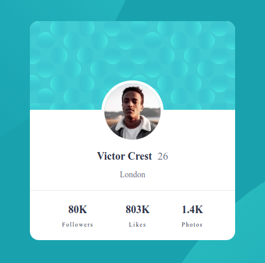

# Frontend Mentor - Profile card component

Please visit my final project at https://jschuh23.github.io/Frontend-Mentor-Projects/Profile-Card-Component/index.html

## The Challenge

Build out a profile card component and get it looking as close to the design as possible

-   Newbie level
-   HTML and CSS skills

### Design info provided

-   Mobile and desktop widths
-   A `style-guide.md` file which contained information regarding base styles - color palette and fonts
-   I am a Frontend Mentor Pro subscriber so I had access to the Figma design file

## My Process

### Tools I used

-   CSS custom properties (variables)
-   Flexbox

### Continued development

-   I used a lot of flexbox in this project. One property that I used was `flex` for declaring values for `flex-grow`, `flex-shrink`, `flex-basis`. I have yet to really use this property so it was great practice!

### Lessons learned

-   This project helped me continue to learn about the `::before` and `::after` pseudo-elements. These were used to position the background circles and the background on the card component. It was quite challenging to layout the large background circles as they extended off the screen. There was a lot of trial and error involved!!
-   I have not really focused on the appearance of previous websites I've built when in landscape mode. Thanks to a comment from a reviewer I adjusted my code to accommodate landscape view by using several media queries.

[Frontend Mentor](https://www.frontendmentor.io) challenges allow you to improve your skills in a real-life workflow.
