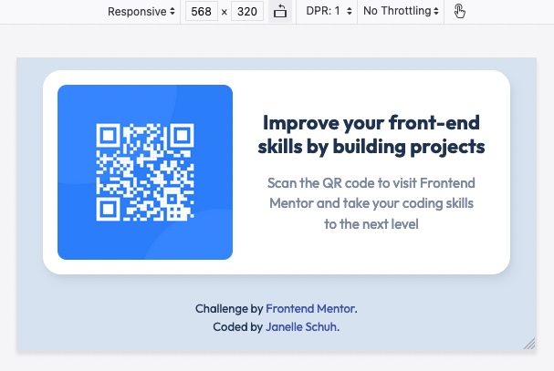

# Frontend Mentor - QR Code Component

This is a solution to the [QR code component challenge on Frontend Mentor](https://www.frontendmentor.io/challenges/qr-code-component-iux_sIO_H). Frontend Mentor challenges help you improve your coding skills by building realistic projects.

## TABLE OF CONTENTS

-   [Overview](#overview)
    -   [The Challenge](#the-challenge)
    -   [Link](#link)
    -   [Screenshots](#screenshots)
-   [My Process](#my-process)
    -   [Built With](#built-with)
    -   [Continued Development](#continued-development)
    -   [Lessons Learned](#lessons-learned)
    <!-- -   [Useful Resources](#useful-resources) -->
-   [Author](#author)

## OVERVIEW

### The challenge

-   Build out a QR code component and get it looking as close to the design as possible
-   Newbie level
-   HTML and CSS skills

### Link

Please visit my final project in my [GitHub repository](https://jschuh23.github.io/Frontend-Mentor-Projects/QR-Code-Component/index.html)

### Screenshots

#### Desktop

#### Mobile

#### Mobile Landscape

## MY PROCESS

### Built with

-   Semantic HTML5 markup
-   CSS Flexbox
-   Logical properties used for margin and padding

### Continued development

-   I continued learning about CSS flexbox during this challenge as I used these techniques to layout the different components.
-   I did a lot of additional research into the best practices for having content that fills the entire viewport both on desktop and on a mobile device. Ultimately, I was trying to solve the `vh` issues that exist within Safari where the menu bar covers the footer on mobile. I tried several different options with `height`, `min-height`, `-webkit-fill-available` but with no luck.

### Lessons learned

-   I did additional research into creating this design in landscape orientation. Initially, I setup my media query for `orientation: landscape` but realized that these values were also affecting my desktop version. This is because that on some monitors (ultrawide, for instance) the width of the monitor is greater than the height. Therefore, the landscape values kick in. So I had to also insert a `max-width` value in the media query to accommodate for this.

<!-- ### Useful resources

- -->

## AUTHOR

-   Frontend Mentor: [@jschuh23](https://www.frontendmentor.io/profile/jschuh23)
-   LinkedIn: [janelle-schuh](https://www.linkedin.com/in/janelle-schuh/)
-   Twitter: [@janelleschuh](https://www.twitter.com/janelleschuh)
